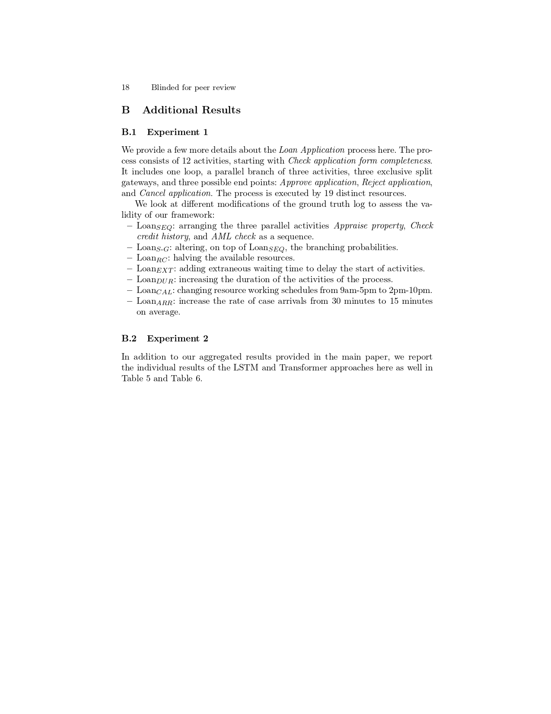
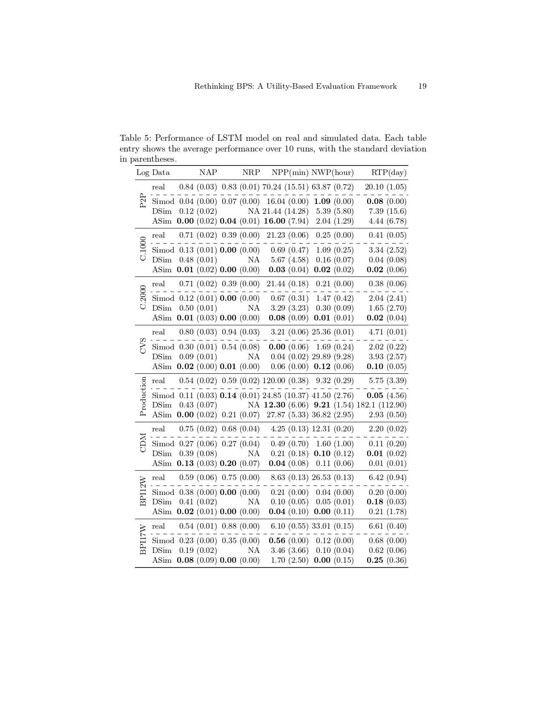
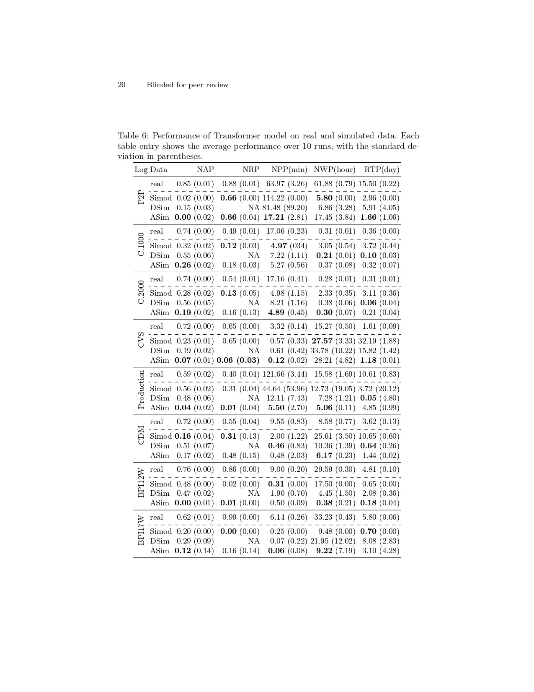
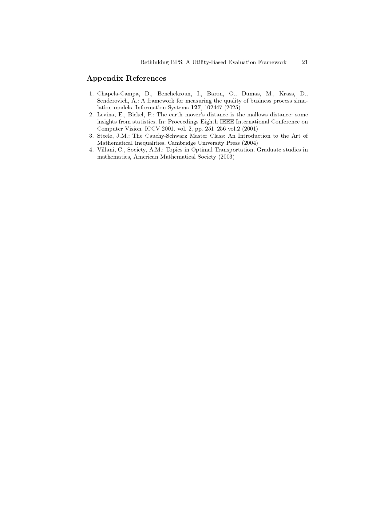

# Rethinking-BPS
Code Base for Paper "Rethinking Business Process Simulation: A Utility-Based Evaluation Framework" by K. Özdemir, L. Kirchdorfer and K. Amiri Elyasi et al. (2025)

## Installation
First, clone this GitHub repository to your local machine:

```bash
git clone https://github.com/konradoezdemir/Rethinking-BPS
```
To install and set up an environment on a Linux system, run the following commands:

```bash
conda create -n BPS python=3.11
conda activate BPS
pip install -r requirements.txt
conda clean --all
```
## Managing raw data
Real event logs, and simulated event logs must be copied into **data** folder. For each event log, a separate folder should be created. Inside the folder real train and test logs should be copied, while the synthetic data for each simulation model should be copied in a separate folder. A sample of required structure is provided for Production event log.

## Running the evauation framework
The **main.py** is responsible for execution of our evaluation framework. For LSTM and Transformer models, separate configuration files are provided within **cfg** folder.
A sample bash script for running the code in batches is provided in **bash_scripts** folder. To run this script, you could simply use the following command:

```bash
sbatch bash_scripts/sample.sh
```

# The Appendix to our Work





